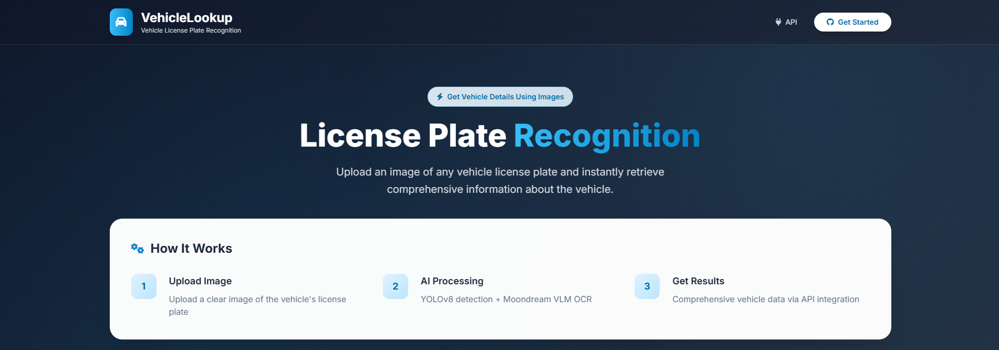

# VehicleLookup – License Plate Recognition (LPNR)



A License Plate Number Recognition (LPNR) system built for academic purposes.
It detects license plates from vehicle images, extracts the text using OCR, and retrieves detailed vehicle information through API integration — all via a simple browser-based interface.

---

## **Features**

* **YOLOv8n** model custom-trained on the Indian Vehicle Dataset for license plate detection.
* **OpenCV preprocessing** to crop and enhance detected plates before OCR.
* **Moondream VLM OCR API** for accurate plate number extraction.
* **RapidAPI integration** for retrieving vehicle details (RTO, insurance, registration, etc.).
* Lightweight **Flask web app** with a clean, modern UI.
* Runs locally on **CPU-only setups** (not optimized for performance since OCR and vehicle info are handled via APIs).

---

## **Tech Stack**

* **Backend**: Python 3.12.10, Flask
* **Detection**: YOLOv8n (`ultralytics==8.3.183`)
* **Image Processing**: OpenCV
* **OCR**: Moondream VLM API
* **Vehicle Data**: [RapidAPI Vehicle Info](https://rapidapi.com/fire-api-fire-api-default/api/rto-vehicle-details-rc-puc-insurance-mparivahan)
* **Frontend**: HTML, CSS, JavaScript (responsive design)

---

## **Project Structure**

```
.
├── assets/                  # Screenshots or reference images for README
├── input_images/            # Uploaded input images for testing
├── cropped_images/          # YOLO-detected and cropped plates
├── templates/               # Frontend templates (index.html, CSS, JS)
├── static/                  # Static assets like CSS/JS (optional, move from templates)
├── pipeline.py              # Runs the full OCR pipeline (setup → preprocess → OCR → API)
├── main.py                  # Flask web app / main entry point
├── preprocess_plate.py      # Plate preprocessing & cropping logic
├── ocr.py                   # OCR integration with Moondream API
├── api_call.py              # RapidAPI vehicle info integration
├── clear_images.py          # Utility to clear input and cropped images
├── best.pt                  # Custom-trained YOLOv8 model weights
├── requirements.txt         # Python dependencies
├── env_setup.py             # Setup pipeline environment 
├── .env                     # API keys (not committed to Git)
└── .gitignore               # Ignore unnecessary files
```

---

## **Setup and Installation**

### **1. Clone the Repository**

```bash
git clone https://github.com/Abhay117004/PR.git
cd PR
```

### **2. Create and Activate Virtual Environment**

**Linux / macOS**

```bash
python -m venv plateenv
source plateenv/bin/activate
```

**Windows**

```cmd
python -m venv plateenv
plateenv\Scripts\activate
```

### **3. Install Dependencies**

```bash
pip install -r requirements.txt
```

### **4. Configure Environment**

Create a `.env` file in the root directory:

```env
OPENAI_API_KEY=your_moondream_key_here
RAPIDAPI_KEY=your_rapidapi_key_here
```

---

## **Usage**

1. Start the Flask app:

```bash
python app.py
```

2. Open your browser and visit:

```
http://127.0.0.1:5000
```

3. Upload a vehicle image, click **Analyze Vehicle**, and view the results.


---

## **Notes and Limitations**

* **API Usage**: RapidAPI free tier is limited to **10 calls per month**.
* **Hardware**: CPU-only supported; detection is slower than GPU setups but functional.
* **Accuracy**: Works best with clear images where plates are unobstructed.
